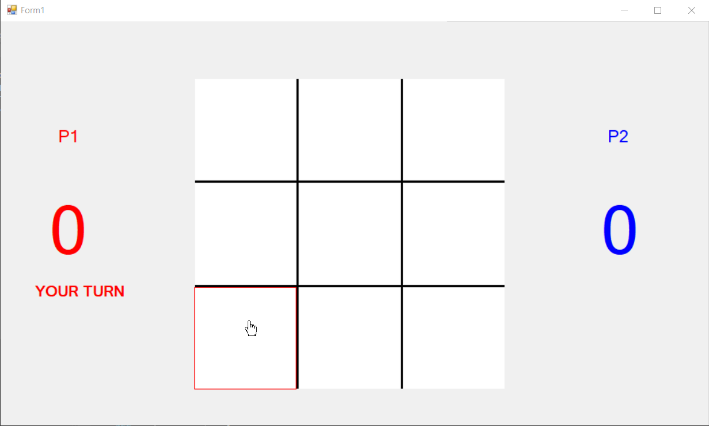
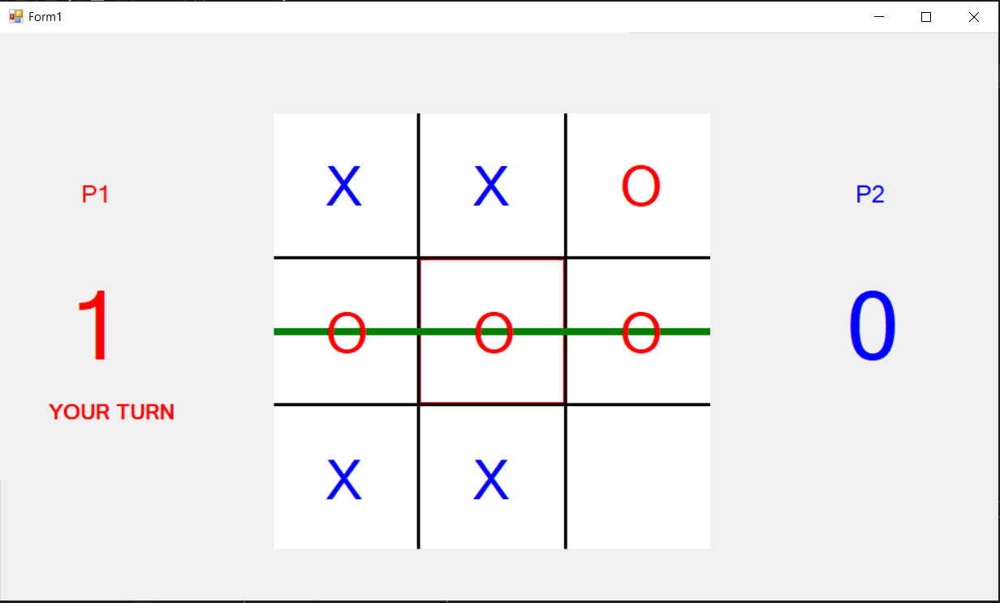

# TicTacToe

### Опис на играта
Х-точка е игра која се игра помеѓу два играчи. Се игра на мрежа од 3х3 полиња и целта на играта е играчот да формира линија од 3 полиња вертикално, хоризонтално или дијгонално кои го содржат неговиот знак (Х или О).

### Како се игра
Играта започнува со едно мени каде имаме можност да започенеме нова игра. Откако ќе започнеме нова игра по случаен избор се избира играчот кој ќе го направи првиот потез. Известување за кој е играчот кој треба да направи потез е означено под резултатот на ирачот, а самиот потез се прави со клик на полето кое сака да го означи играчот. Победник е играчот кој ќе оствари 3 победи и добива известување затоа дали сака да започне нова игра или да ја затвори апликацијата. Резултатот се ажурира после секоја рунда, доколку сите полиња се пополнат но играчите не успеале да формираат победничка линија, тогаш започнува нова рунда а бројот на победи останува непроменет.

### Опис на решение
За оваа апликација се искористени три класи: Block, Scene и Player. 

Класата блок претставуа едно поле од мрежата, во него се чуваат податоци за големината на полето (size), bool променлива која ни покажува дали полето е селектирано (isSelected) и bool променлива која ни покажува дали полето е пополнето (isSet). Класата има два методи draw() која го исцртува полето и isHit() кој ни покажува дали сме кликнале на полето.

Класата Scene претставува класа која ја претставува 3х3 мрежата. Се состои од листа на блокови и метод за исцртување на мрежата.

Класата Player е класа која го претставуа играчот. Се состои од име на играчот, боја, резултат и знакот со кој е претставен (Х или О)

### Oпис на функции

checkWin() - функција која проверува дали играчот остварил победничка линија и ја зачува победничката линија со цел да може да се исцрта линија која ги поврзува трите полиња.

draw() - функција која ја исцртува мрежата и победничката линија доколку ја има.

changePlayer() - Промена на тековниот играч.

